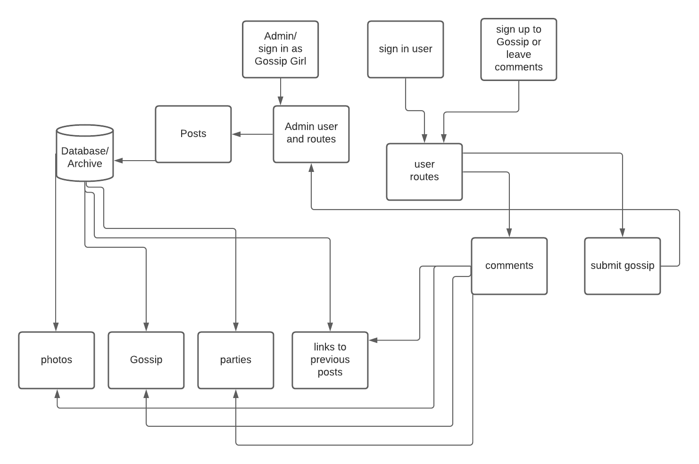
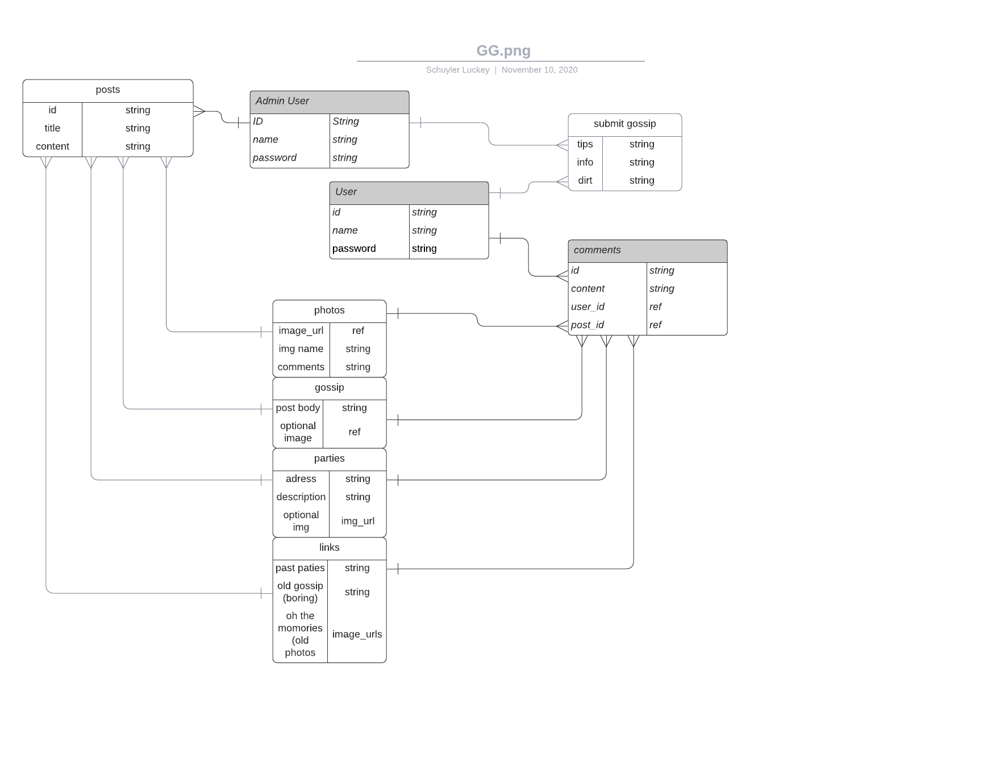

# Welcome to: 

 
    

#### Created by Schuyler Luckey
***

### This website is dedicated to all the hot gossip about the elite & chic from Manhattan to L.A.
### Who is doing who and what's what, if you want to know all the knitty gritty details then you've come to the right place.  
***

# To participate in this lovely community simply:
* Create a User name and password 
* Give us your email, (don't worry we just want to tell you about all the hot gossip) 
* And then simply log in. 

## Things you will need to know
1. You will be able to comment on posts and send in hot tips about parties and juicy gossip. 
2. Sadly you won't be able to post anything other than comments, all the actual posting, well that is done by yours truly. 
3. Oh and Don't worry all tips and gossip I receive will remain 100% confidetial
4. I will keep all your dirty little secrets safe until I deem them gossip worthy.

## What do you get from this?
***
### Well let me tell you. Did you ever hear about that AMAZING party after it happened? Perhaps your invitation got lost in the mail, perhaps they don't like you or perhaps nobody realized you have a fantastic wardrobe and witty social skills. Whatever the case we will tell you about all the hot parties in town, all the hot guys and girls that will be there. And all of the embarassing things they do when they think no one will find out. 

# Technology used 

 
    

***
# I am attempting to recreate the Website from the hit tv show Gossip Girl
### This is the template that I will be basing my project off of. 

 
    

***
## This is how I imagine my data should flow.
### Front End Flow

### Back End Flow 

